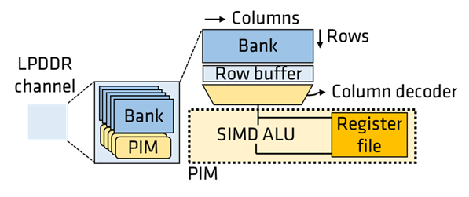
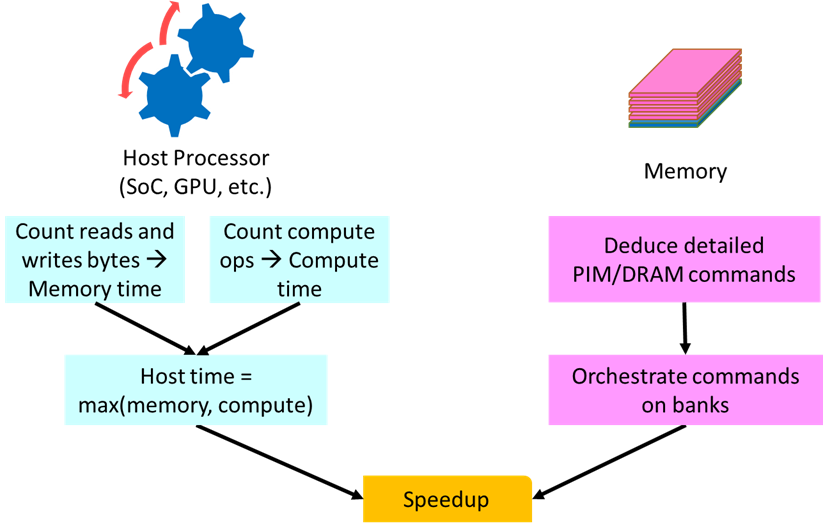

<!-- # AMD RAD PIM GEMV Analytical Performance Model -->
# AMD GeniePIM
This repository contains AMD GeniePIM, a processing-in-memory (PIM) analytical performance model for Generative AI (GenAI). Specifically, AMD GeniePIM models GEMV execution on emerging PIM architectures. AMD GeniePIM allows users to calculate performance speedup of PIM execution compared to host (e.g., GPU) execution given a user-defined PIM/host configurations and list of GEMV sizes of interest. Other than performance speedup, AMD GeniePIM can also generate PIM execution time breakdown.

`AMD GeniePIM is a wordplay combining GenAI and PIM. Consider it your genie for PIM analytical performance modeling.`

## Table of Contents
- [AMD GeniePIM](#amd-geniepim)
  - [Table of Contents](#table-of-contents)
  - [Getting Started](#getting-started)
    - [How to run AMD GeniePIM?](#how-to-run-amd-geniepim)
    - [Requirements](#requirements)
  - [Background](#background)
    - [Processing-in-Memory (PIM)](#processing-in-memory-pim)
    - [Analytical Performance Model](#analytical-performance-model)
  - [AMD GeniePIM Inputs/Outputs](#amd-geniepim-inputsoutputs)
    - [Input File Format](#input-file-format)
    - [GEMV Input File](#gemv-input-file)
    - [LLM Input File](#llm-input-file)
    - [Config File Format](#config-file-format)
    - [Default Output File Format](#default-output-file-format)
  - [AMD GeniePIM Citation](#amd-geniepim-citation)
  - [Bonus](#bonus)
  - [Disclaimer](#disclaimer)

## Getting Started

### How to run AMD GeniePIM?
To run AMD GeniePIM, using:

```bash
# Run with the default options.
python3 run_geniepim_core.py
```

```bash
# Check AMD GeniePIM help.
python3 run_geniepim_core.py --help
```

AMD GeniePIM offers the following options. 

- Pick an output file. Default output file is `out_pim.csv`. Output files are always saved in `Outputs/` directory, therefore **only** the output file name is required. Output files of the same name are overwritten. Format of the output file is discussed below.
    > `--output_file` \<output file name\>
                        
- Pick an output format. Default and the only implemented option is `1`, where `0` = output all parameters and results, `1` = output condensed results, and `2` = custom. Default output format is discussed below.
    > `--output_file_format` {0,1,2}

- Pick a mode to feed GEMV sizes of interest to AMD GeniePIM. Default is `gemm` which indicates providing a list of GEMV sizes as an input. Another option is `models` which indicates providing a list of large language models (LLMs) hyperparameters and AMD GeniePIM will generate the list of the corresponding GEMV sizes. Format of both files is discussed below. Finally, AMD GeniePIM is flexible and allows a `custom` option to be implemented. 
    > `--gemm_gen_mode` {gemm,models,custom}
                    
- Pick a GEMV or LLMs input file. Input files are always stored in `Inputs/GEMMs` or `Inputs/LLMs` based on the selected `gemm_gen_mode`, therefore **only** the input file name is required. 
    > `--gemm_gen_input` \<GEMV input file name\>

- Pick a configuration file for PIM, and host. Default config file is `config.in`. Input config files are always stored in `Inputs/Configs`, therefore **only** the config file name is required. Format of the config file is discussed below.
    > `--config_input_file` \<config file name\>

- Enable/Disable debug flag. This option provides more details/timings to help debug the output. Default option is `0`, where `0` = disable, and `1` = enable.        
    > `--debug` {0,1}

Examples:

```bash
# Change the output file.
python3 run_geniepim_core.py --output_file=<output file name>
```

```bash
# Run GEMV input mode while specifying an input file.
python3 run_geniepim_core.py --gemm_gen_mode=gemm --gemm_gen_input=<GEMV input file name>
```

```bash
# Run LLM input mode while specifying an input file.
python3 run_geniepim_core.py --gemm_gen_mode=models --gemm_gen_input=<LLM input file name>
```

```bash
# Run GEMV input mode while specifying an input file and a config file.
python3 run_geniepim_core.py --gemm_gen_mode=gemm --gemm_gen_input=<GEMV input file name> --config_input_file=<config file name>
```

```bash
# Run LLM input mode while specifying an input file, a config file with no-scale-factor data format (8bx8b), and detailed output.
python3 run_geniepim_core.py --output_file_format=2 --gemm_gen_mode=models --gemm_gen_input=models.in --config_input_file=config.in --output_file=nosf.csv --output_ignore_header=0
```

```bash
# Run LLM input mode while specifying an input file, a config file with scale-factor data format (8bx8b), and detailed output.
python3 run_geniepim_core.py --output_file_format=2 --gemm_gen_mode=models --gemm_gen_input=models.in --config_input_file=sf_config.in --output_file=sf.csv --output_ignore_header=0
```

### Requirements
1. Python >= 3
2. To understand AMD GeniePIM's analytical performance model, please read "[PIMnast](https://doi.org/10.1109/SCW63240.2024.00137): Balanced Data Placement for GEMV Acceleration with Processing-In-Memory". 
3. To understand the modeled block-level scale-factors, please refer to "OCP Microscaling Formats (MX) [Specification](https://www.opencompute.org/documents/ocp-microscaling-formats-mx-v1-0-spec-final-pdf)" or "Microscaling Data Formats for Deep Learning" [paper](https://arxiv.org/pdf/2310.10537). 

## Background 

### Processing-in-Memory (PIM)  

<figure align="center">
  
  <!-- <figcaption>LPDDR-PIM overview</figcaption> -->
</figure>

Recently, multiple memory vendors have proposed commercially viable PIM designs that can be integrated with HBM as well as LPDDR and GDDR memory. These designs place a computation unit/ALU near memory banks as shown above for LPDDR memory as an example.

Baseline LPDDR memories are comprised of independent channels and multiple banks therein. A read (or write) access, causes a specific DRAM row in a specific bank to be activated, wherein a data in the row is read out to row-buffer associated with the bank. Subsequently, a column access command reads a specific DRAM word (typically 256bits) from the row-buffer over the shared data-bus in the channel. In contrast, with PIM, higher effective bandwidth can be attained by activating same row across all banks (all-bank row activation) followed by broadcasting same column command in parallel to all banks. This leads to memory bandwidth boost commensurate to number of banks (typically 16 banks per channel) and PIM command rate (typically 2x lower than baseline reads/writes), about 4-8x in practice as demonstrated by PIM prototypes. 

The computation unit near memory banks comprise a SIMD ALU and register file. Further, as only parts of applications which demand high memory bandwidth are offloaded to PIM, interoperability with SoC (CPUs, GPUs, etc.) is paramount. Consequently, PIM designs lack sophisticated instruction orchestration capabilities and instead are controlled via read/write like fine-grain PIM commands from the processor. Finally, data consistency between processor and PIM is typically enforced in software (e.g., cache flushes). 

### Analytical Performance Model  

<figure align="center">
  
  <!-- <figcaption>Analytical model overview</figcaption> -->
</figure>

We analyze the performance using analytical models as PIM is currently only available as part of functional prototypes. Below is an overview of the analytical models using a LPDDR-PIM in a client SoC as an example. 

- **GEMV-SoC Performance Model:** Client SoCs are rich with diverse compute components (CPU, GPU, and AIE), each with its own compute throughput and available memory bandwidth. Execution time for GEMV is the maximum of compute-time (GEMV ops / available TOPs) and memory-time (matrix bytes / available memory bandwidth). 

- **GEMV-PIM Performance Model:** For GEMV mapped to PIM, we assume a PIM architecture representative of recent PIM designs from memory vendors. The PIM commands are issued by the SoC as special load/store accesses which bypass the caches and issued in-order by the memory controller to multiple banks in parallel. Based on GEMV under consideration, data mapping and orchestration, we deduce the exact DRAM commands needed to orchestrate the computation and incorporate necessary overheads (e.g., DRAM row open overheads, read-to-write turnaround, etc.). 

## AMD GeniePIM Inputs/Outputs 

### Input File Format
This section discusses the formats of both the input GEMV sizes file and the input LLMs file. Note that both files must have a header line, therefore when creating new input files, keep the respective header line as it is.

### GEMV Input File 
This input CSV file list all the GEMV sizes of interest to the user. We assume a GEMV of `MxK` multiplied by `KxN` to get an `MxN`. The following is an example listing two GEMMs of sizes (M=8192,K=8192,N) and (M=4096,K=4096,N), where N = {1, 2, 4, 8, 16, 32}.

> `NAME,MATRIX_ID,GEMM_M,GEMM_K,BATCH_SIZE,GEMM_N_VALUES`\
test-model,test8k,8192,8192,1,1/2/4/8/16/32\
test-model,test4k,4096,4096,1,1/2/4/8/16/32

Format is as follows:
- `NAME` = Name of the workload or ML model with the respective GEMV size. Both GEMMs listed above are in a toy workload/model called *test_model*.
- `MATRIX_ID` = Name/id of the evaluated GEMV. This can be based on the workload/model under study or it can be any given name/id for output parsing purposes. The GEMMs in the example above are called *test8k* and *test4k*, respectively, reflecting their sizes.
- `GEMM_M` = M dimension size of the evaluated GEMV.
- `GEMM_K` = K dimension size of the evaluated GEMV.
- `BATCH_SIZE` = Batch-size for batched-GEMMs. This is **not** the N dimension of the evaluated GEMV.
- `GEMM_N_VALUES` = List of values for the N dimension of the evaluated GEMV separated by `/`.    

### LLM Input File 
This input CSV file list all the LLMs of interest to the user. The following is an example listing an LLM model of size 1.3B parameters. AMD GeniePIM uses these hyperparamters and generates the list of executed GEMVs during inference. The LLMs included included in `models.in` are from [OPT: Open Pre-trained Transformer Language Models](https://arxiv.org/abs/2205.01068).

> `NAME,H,I,A,SL_LIST,B_LIST,PROMPT_SIZE_LIST,T_LIST`\
1.3B,2048,8192,32,1,1/2/4,512/1024/2048,512/1024/2048

Format is as follows:
- `NAME` = Name of the LLM. The LLM listed above has 1.3B parameters, so we assigned *1.3B* as its name.
- `H` = Size of the hidden dimension. 
- `I` = Feed forward network inner layer size (I = 4H).
- `A` = Number of attention heads.
- `SL_LIST` = List of evaluated sequence length separated by `/`.
- `B_LIST` = List of evaluated batch-sizes separated by `/`. This is **not** the batch-size used for batched-GEMMs. 
- `PROMPT_SIZE_LIST` = List of evaluated prompt size separated by `/`.
- `T_LIST` = List of evaluated number of tokens separated by `/`.

### Config File Format
Check the comments in the config file `Inputs/Configs/config.in` for more information. Change any parameters in the config file but do **not** remove any parameter as there is no default value per parameter so far.  

### Default Output File Format
The following is an example of the AMD GeniePIM's default output.

> `MODEL_SIZE,SOURCE,M,K,N,HOST_TIME,PIM_TIME,SPEEDUP`\
1.3B,ip-proj,6144,2048,1,98304.0,19043.679999999997,5.162027507288508\
1.3B,op-proj,2048,2048,1,32768.0,6533.839999999999,5.015121276309185\
1.3B,linear1,8192,2048,1,131072.0,25004.68,5.24189871656026\
1.3B,linear2,2048,8192,1,131072.0,25711.219999999998,5.097852221714878\
1.3B,ip-proj,6144,2048,2,98304.0,38087.35999999999,2.581013753644254\
1.3B,op-proj,2048,2048,2,32768.0,13067.679999999998,2.5075606381545925\
1.3B,linear1,8192,2048,2,131072.0,50009.36,2.62094935828013\
1.3B,linear2,2048,8192,2,131072.0,51422.439999999995,2.548926110857439\

Format is as follows:

- `MODEL_SIZE` = Name of the workload, ML model, LLM used either in GEMV input file or LLM input file.
- `SOURCE` = Name/id of the evaluated GEMV. This is either the name provided by the used in the GEMV input file, or it is a name representative of the GEMV in LLM. Specifically, *ip-proj*, *op-proj*, *linear1*, and *linear2* are the names of the four GEMVs executed during inference. 
- `M` = M dimension size of the evaluated GEMV.
- `K` = K dimension size of the evaluated GEMV.
- `N` = N dimension size of the evaluated GEMV.  
- `HOST_TIME` = Estimated time (ns) for host execution. 
- `PIM_TIME` = Estimated time (ns) to PIM execution.
- `SPEEDUP` = Estimated PIM performance speedup over the evaluated host.

## AMD GeniePIM Citation

If you use AMD GeniePIM in your work, please cite us as below:

> @software{AMD GeniePIM,\
    author      = {Mohamed Assem Ibrahim, Mahzabeen Islam, and Shaizeen Aga},\
    title       = {AMD GeniePIM - A Processing-In-Memory (PIM) Analytical Performance Model for GenAI},\
    year        = {2025},\
    publisher   = {Advanced Micro Devices, Inc.},\
    url         = {https://github.com/AMDResearch/AMDGeniePIM }
}

OR

> @inproceedings{PIMnast,\
    author     = {Mohamed Assem Ibrahim, Mahzabeen Islam, and Shaizeen Aga},\
    title      = {PIMnast: Balanced Data Placement for GEMV Acceleration with Processing-In-Memory},\
    year       = {2025},\
    doi        = {10.1109/SCW63240.2024.00137},\
    booktitle  = {Proceedings of the SC'24 Workshops of the International Conference on High Performance Computing, Network, Storage, and Analysis},\
    pages      = {970–981},\
    url        = {https://doi.org/10.1109/SCW63240.2024.00137 }
}

## Bonus

Check the following for more PIM work from the team. 
1. [\[MLSys'24\]](https://proceedings.mlsys.org/paper_files/paper/2024/hash/136b9a13861308c8948cd308ccd02658-Abstract-Conference.html) JIT-Q: Just-in-time Quantization with Processing-In-Memory for Efficient ML Training
2. [\[MEMSYS'24\]](https://dl.acm.org/doi/abs/10.1145/3695794.3695796) Pimacolaba: Collaborative Acceleration for FFT on Commercial Processing-In-Memory Architectures
3. [\[MEMSYS'24\]](https://dl.acm.org/doi/abs/10.1145/3695794.3695795) PIM-Potential: Broadening the Acceleration Reach of PIM Architectures
4. [\[iMACAW @ DAC'23\]](https://eclectx.org/iMACAW/2023/iMACAW_DAC_2023_slides_posters/iMACAW_Ibrahim_ML_poster.pdf) Accelerating ML Preprocessing: Third Pillar of ML
5. [\[iMACAW @ DAC'23\]](https://eclectx.org/iMACAW/2023/iMACAW_DAC_2023_slides_posters/iMACAW_Ibrahim_PIMRT_Poster.pdf) Accelerating Ray Tracing via Processing in Memory


## Disclaimer

AMD GeniePIM is an AMD open source research project and is not supported as part of the ROCm software stack. We welcome contributions and feedback from the community.

Licensing information can be found in the [LICENSE](LICENSE) file.
